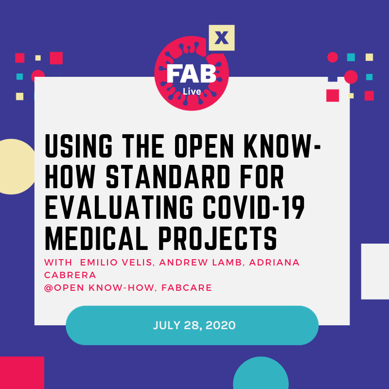

# Using the Open Know-How Standard for evaluating COVID-19  medical projects

This is the workshop documentation for the 2020 FabXlive event.

Contents
========
[Description](##Description)

## Description
==============
The COVID-19 pandemic was addressed by a surge of open source projects made by makers around the world. As a result of these decentralized and hasty efforts, users have been overwhelmed by a variety of redundant ideas, as well as a lack of complete and standardized documentation. This will be mainly a documentation workshop on which we will explore the Open Know-How Standard (openknowhow.org/). During the workshop we will learn how to make OKH Manifest files and use it to document and evaluate medical designs for COVID-19 around the web. We will use this information to learn how to effectively discover, compare and select the best projects from a list of devices. As a final activity, we want to discuss the possibility to apply Open Know-How for a wider variety of applications in the maker community.

## What's on this documentation?
================================
- [Workshop presentation (coming soon).](/presentation/slides.html).
- [The Open Know-How manifests created during the workshop.](/workshop_manifests)
- [A PHP snippet and webpage used to upload manifests.](/webpage)
- [The R script used to create the graphs.](/script)
- [The graph created on the workshop.](/script/graph-output.html).

_Note: In order to see the slides and graph, download the webpages and open from your computer._

## Practical part of the workshop
=================================

### Instructions
================
1. Category selection
1. Projects evaluation
1. Discussion and feedback

### tl;dr Links you will use
- [Manifest Maker Form (Powered by Makernet.org)](https://okh.makernet.org/form)
- 

## Learn more
- Open Know-How Standard: [Website](https://openknowhow.org/) | [Documentation](https://app.standardsrepo.com/MakerNetAlliance/OpenKnowHow/src/branch/master/1)

## Presenters

* Andrew Lamb: Andrew is a Shuttleworth Foundation fellow exploring the concept of ‘Massive Small Manufacturing’, and organiser of the Open Know-How working group. He is the Global Innovation Lead for Field Ready, an international humanitarian organisation that manufactures aid supplies in the field. He is also the chair of the Internet of Production Alliance, and the Open Know-How group which is developing an open data standard for the documentation of hardware designs. Andrew’s work focuses on enabling the local production of aid supplies at scale by infrastructure, techniques and partnerships with large international aid organisations and UN agencies.

* Emilio Velis: Emilio is an industrial engineer based in San Salvador. He received the MIT Technology Review Innovators Under 35 Award in 2015 for Reacción, an open hardware initiative for social and environmental resilience. He serves as part of the local and regional leadership for the Latin American Fab Lab Network, Internet Society, the Open Hardware Association and Creative Commons. For the past years, he had experience at Habitat for Humanity and Techo, focusing on poverty alleviation through volunteer management and resource development. Emilio is currently the Executive Director of the Appropedia Foundation.

Adriana Cabrera