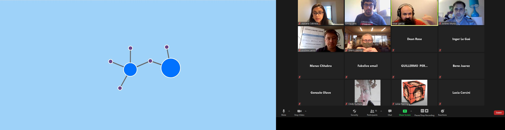

# Using the Open Know-How Standard for evaluating COVID-19  medical projects

This is the workshop documentation for the 2020 FabXlive event.

## Contents
- [Description](#Description)
- [What is on this repo?](#what-is-here)
- [Workshop instructions](#workshop-instructions)
- [tl;dr Links](#tldr-links-you-will-use)
- [About the facilitators](#about-the-facilitators)

## Description
The COVID-19 pandemic was addressed by a surge of open source projects made by makers around the world. As a result of these decentralized and hasty efforts, users have been overwhelmed by a variety of redundant ideas, as well as a lack of complete and standardized documentation. This will be mainly a documentation workshop on which we will explore the Open Know-How Standard (openknowhow.org/). During the workshop we will learn how to make OKH Manifest files and use it to document and evaluate medical designs for COVID-19 around the web. We will use this information to learn how to effectively discover, compare and select the best projects from a list of devices. As a final activity, we want to discuss the possibility to apply Open Know-How for a wider variety of applications in the maker community.

## What is Here?
- [Workshop presentation](https://emiliovelis.com/okh/slides.html) | [Source code](/presentation/slides.html).
- [The Open Know-How manifests created during the workshop.](/workshop_manifests)
- [A PHP snippet and webpage used to upload manifests.](/webpage)
- [The R script used to create the graphs.](/script)
- [The graph created on the workshop.](https://emiliovelis.com/okh/graph-output.html) | [Source code](/script/graph-output.html).

_Note: In order to see the slides and graph, download the webpages and open from your computer._

## Workshop Instructions
This workshop will focus on how to effectively document and evaluate redundant projects. We will focus on projects created during the COVID-19 pandemic over the past 3-4 months.

### Choose a project from the list 
Please put your name next to it to avoid repeated projects.
### Create a manifest using the [tool at https://okh.makernet.org/form](https://okh.makernet.org/form).
Fill it out based on the available documentation. Focus on the required fields. We'll describe them during the workshop but you can also check the [documentation](https://app.standardsrepo.com/MakerNetAlliance/OpenKnowHow/src/branch/master/1):

- *Name of the hardware* (please help with some extra description if the makers weren't too original!)
- *Description* (just copy and paste from the documentation page).
- *Keywords*: **we'll focus mostly on these for this workshop**. Please help us by choosing the following: 
    - At least 3 keywords related to its **materials**. For example: fabric, cotton, chiffon, polypropylene, HVAC filter, elastic, nanofiber, plastic, wire, acrylic, MDF, paper towel.
    - At least 3 keywords related to **machines and tools** used to make it. For example: 3D printer, laser cutter, hand made, sewing machine.
    - At least 3 Keywords related to **skills or abilities** required to make. For example: sewing, cutting, drawing, tracing, 3D modelling.
    - 3 keywords that you may use to **describe the project** from what you've read. For example: cheap, simple, intricate, specialized, complex, etc.
- *License*
Check if it's licensed. If not, you can leave this blank. Check https://spdx.org/licenses/ for an identifier.
- *Author of the manifest*
Your name and email will suffice.

### Download the manifest

After you're done making the manifest, press "Download" and save it to your computer. You should have a file named okh.yml (you can rename it if you want).

### Upload the manifest and fill out an evaluation
Go to [this link](https://emiliovelis.com/okh/). Select the manifest file and evaluate the project (input a number from 0 to 10) for the following questions:
1. How effective do you believe it is? (0=not at all; 10=super effective)
2. How expensive is it? (0=too expensive; 10=very affordable)
3. Would it be easy to find its materials? (0=not easy; 10=very easy)
4. How easy is it to fabricate?  (0=too difficult; 10=very easy)
5. How durable does it look? (0=not durable or disposable; 10=it looks very durable)

Press "Submit" after you're done.

### That's it! 
After we're done, we will answer questions and then we'll show you the results.

## tl;dr Links You Will Use
- [Manifest Maker Form (Powered by Makernet.org)](https://okh.makernet.org/form)
- [Where you will upload and evaluate the manifest](https://emiliovelis.com/okh/)
- Learn about Open Know-How: [Website](https://openknowhow.org/) | [Documentation](https://app.standardsrepo.com/MakerNetAlliance/OpenKnowHow/src/branch/master/1)

## About the Facilitators

* Andrew Lamb: Andrew is a Shuttleworth Foundation fellow exploring the concept of ‘Massive Small Manufacturing’, and organiser of the Open Know-How working group. He is the Global Innovation Lead for Field Ready, an international humanitarian organisation that manufactures aid supplies in the field. He is also the chair of the Internet of Production Alliance, and the Open Know-How group which is developing an open data standard for the documentation of hardware designs. Andrew’s work focuses on enabling the local production of aid supplies at scale by infrastructure, techniques and partnerships with large international aid organisations and UN agencies.

* Emilio Velis: Emilio is an industrial engineer based in San Salvador. He received the MIT Technology Review Innovators Under 35 Award in 2015 for Reacción, an open hardware initiative for social and environmental resilience. He serves as part of the local and regional leadership for the Latin American Fab Lab Network, Internet Society, the Open Hardware Association and Creative Commons. For the past years, he had experience at Habitat for Humanity and Techo, focusing on poverty alleviation through volunteer management and resource development. Emilio is currently the Executive Director of the Appropedia Foundation.

* Adriana Cabrera:  is leader, together with Enrico Bassi, of the global FabCare group. She works as senior consultant in innovation and Product development at matrix GmbH & Co., as well as a researcher for FabLab Kamp- Lintfort, Germany, at the Rhine–Waal University of Applied Sciences. She is a global lecturer in the soft robotics field in the Fabricademy, part of the Academany advanced training programs offered by the FabFoundation. Adriana has collaborated in the Fab Lab community for many years by actively offering activities in the fields of fabrication for health care, smart textiles, and research materials in digital manufacturing, shown in the FabMaterials library. She has also participated in the exploration of prototyping in isolated environments with the MIT Design and Computation Group during the opening of FabLab Austral in the Chilean South Antarctic.

Originally from Colombia, she works in diverse areas of design and tangible interaction. Having a background in industrial design, she complemented her studies with an MFA in Media Art and Design at Bauhaus University Weimar and later with an MA in Surface and Textile Design at the Weißensee Academy of Art Berlin, focusing on materials research. She is implementing sustainable experimentation by exploring new bio-inspired designs, including the impacts of today's prototyping.

 
